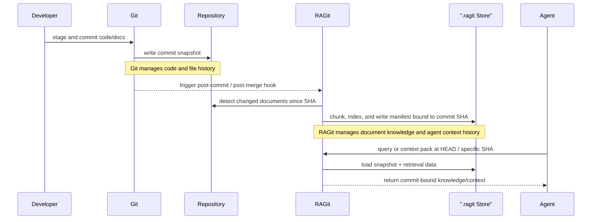

# RAGit

RAGit is a **zvec + git bound RAG CLI** that runs inside your project repository.  
It collects, analyzes, and retrieves documents produced during AI agent workflows, then version-controls snapshots bound to commit SHAs.

## Product Purpose

RAGit is a local-first RAG CLI that turns AI agent project documents and context into commit-bound, reusable knowledge inside the repository.

## Git vs RAGit

Git version-controls source code states. RAGit version-controls AI-working knowledge states bound to the same commit history.



- Git answers: "What did the repository look like at this commit?"
- RAGit answers: "What knowledge and context should an agent use at this commit?"
- Together they make code state and AI context state reproducible.

## Core Value

- Preserve project context across AI agent work
- Reproduce knowledge at a specific commit state
- Turn structured docs into agent-ready inputs
- Automate indexing without adding workflow friction

## MVP Document Types (v0.1)

- ADR
- PRD
- SRS
- SPEC
- Plan
- DDD
- Glossary
- PBD

- `SRS`: system-level software requirements
- `SPEC`: implementation-level functional requirements and interface contracts
- `PBD`: phase and binding topology for understanding implementation structure and coupling

## Installation

Requirements:

- Node.js `20.19.0` or newer
- pnpm `10.13.1` or newer

```bash
pnpm install
pnpm ragit --help
```

Inside this repository checkout, run CLI commands with `pnpm ragit <command>`.
When the package is installed as a published CLI, use `ragit <command>`.

`pnpm build` is optional for repository-local usage.
Run it only when you need to generate `dist/` artifacts or verify the packaged CLI entrypoint.

```bash
pnpm build
```

## Documentation (Fumadocs + GitHub Pages)

- Primary URL (English): `https://rhiokim.github.io/ragit/en/`
- Korean URL: `https://rhiokim.github.io/ragit/ko/`
- English is the source of truth, and Korean is provided in the same structure.

Run locally:

```bash
pnpm docs:dev
```

Build static output and preview:

```bash
pnpm docs:check:i18n
pnpm docs:build
pnpm docs:serve
```

Deployment:

- GitHub Actions deploys automatically to `gh-pages` when `main` is pushed.
- For manual redeploy, run `docs-gh-pages` via `workflow_dispatch`.
- In Repository Settings > Pages, set Source to `gh-pages` / root(`/`).

## Core Commands

```bash
pnpm ragit init
pnpm ragit init --yes --output json
pnpm ragit init --yes --git-init
pnpm ragit config set retrieval.top_k 8
pnpm ragit hooks install
pnpm ragit ingest --all
pnpm ragit query "DDD bounded context principles" --format both
pnpm ragit context pack "Implementation plan for this sprint" --budget 1200
pnpm ragit migrate from-json-store --dry-run
pnpm ragit migrate from-sqlitevss --dry-run
pnpm ragit status
pnpm ragit doctor
```

## Storage Layout

```text
.ragit/
  config.toml
  guide/guide-index.json
  guide/templates/
  manifest/<commit-sha>.json
  store/meta.json
  store/documents/
  store/chunks/
  cache/
  hooks/
```

- Recommended for Git tracking: `.ragit/config.toml`, `.ragit/manifest/**`
- Local-only (default `.gitignore`): `.ragit/store/**`, `.ragit/cache/**`

## Interactive `init` Guide

By default, `pnpm ragit init` runs a 7-step interactive wizard:

1. Check Git environment (suggest `git init` if not a repository)
2. Confirm initialization mode
3. Load or create root `AGENTS.md`
4. Confirm document template scope (ADR/PRD/SRS/SPEC/Plan/DDD/Glossary/PBD)
5. Incrementally generate `.ragit/guide` and refresh `guide-index.json`
6. Bootstrap the zvec canonical store
7. Print summary table and next actions

What `init` prepares:

- Git-aware control-plane setup for `.ragit/`
- Root `AGENTS.md` load-or-create flow
- `.ragit/config.toml`, `.ragit/guide/templates/*`, and `.ragit/guide/guide-index.json`
- Empty zvec collections under `.ragit/store/`
- Store metadata for canonical backend, schema version, and embedding contract
- Next-action guidance for `hooks install` and `ingest`

What `init` does not prepare:

- No searchable corpus, chunk records, or manifests
- No document scan, chunk generation, or vector upsert
- No query-ready knowledge state during `init`
- No query-ready knowledge state until `pnpm ragit ingest ...` runs

In other words, `init` makes the repository **guide-ready** and **zvec-store-ready**, not **search-ready**.
`storage.backend = "zvec"` now means the canonical backend, and `init` bootstraps empty collections without indexing repository documents.

Supported options:

```bash
pnpm ragit init --yes              # non-interactive with defaults
pnpm ragit init --non-interactive  # alias of --yes
pnpm ragit init --git-init         # allow git init in non-interactive mode
pnpm ragit init --output json      # JSON summary output
```

Recommended flow after `init`:

```bash
pnpm ragit migrate from-json-store   # only if summary says migrationRequired=true
pnpm ragit hooks install
pnpm ragit ingest --all
```

## Hook Strategy

- `post-commit`: automatically indexes changes from `HEAD~1..HEAD`
- `post-merge`: automatically indexes changes from `${ORIG_HEAD:-HEAD~1}..HEAD`
- Failures are warning-only and do not block commit/merge flows.

## Retrieval Strategy

- 1st pass: zvec vector search scoped to the snapshot manifest
- 2nd pass: keyword score
- Final score: `alpha * vector + (1-alpha) * keyword` (default `alpha=0.7`)

## Security Defaults

- Secret masking is enabled by default during ingestion (`security.secret_masking=true`)
- OpenAI/GitHub/AWS keys and `api_key/token/secret` patterns are masked.

## Test

```bash
pnpm test
```
