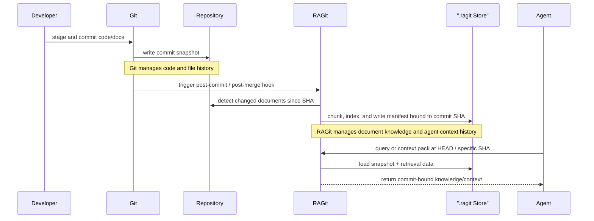

# RAGit

RAGit is a **zvec + git bound RAG CLI** that runs inside your project repository.  
It collects, analyzes, and retrieves documents produced during AI agent workflows, then version-controls snapshots bound to commit SHAs.

## Product Purpose

RAGit is a local-first RAG CLI that turns AI agent project documents and context into commit-bound, reusable knowledge inside the repository.

RAGit is not a giant transcript archive. It is an agent-first collaboration memory system that preserves the smallest reusable state needed to resume work at a given commit: goal, constraints, stable decisions, open loops, and next actions. By separating active working memory from durable searchable memory, it helps the next agent recover momentum without replaying the entire past.

## Runtime Structure

The runtime structure below shows how `ragit` connects the CLI, command layer, core services, git-bound snapshots, and local storage.

```text
                               ┌────────────┐
                               │User / Agent│
                               ├────────────┤
                               └────────────┘
                                      |
                                      |
                                 ┌─────────┐
                                 │ragit CLI│
                                 ├─────────┤
                                 └─────────┘
                                      |
                       ┌────────────────────────────┐
                       │Command Layer               │
                       ├────────────────────────────┤
                       │init                        │
                       │ingest                      │
                       │query                       │
                       │context pack                │
                       │memory                      │
                       │session / artifact / harness│
                       └────────────────────────────┘
                                      |

                            ┌───────────────────┐
                            │Core Services      │
 ┌─────────────────┐        ├───────────────────┤
 │Git commit / HEAD│        │doc authority      │
 ├─────────────────┤        │manifest           │
 │snapshot binding │        │retrieval          │
 └─────────────────┘        │memory             │
           |                │artifacts / harness│
           |                └───────────────────┘
           |
┌────────────────────┐                               ┌─────────────┐
│.ragit control plane│              ┌────────────┐   │Outputs      │
├────────────────────┤  ┌───────┐   │.ragit/store│   ├─────────────┤
│config              │  │docs/**│   ├────────────┤   │query hits   │
│manifest            │  ├───────┤   │documents   │   │context pack │
│memory              │  └───────┘   │chunks      │   │recall packet│
│artifacts           │              └────────────┘   └─────────────┘
└────────────────────┘
```

- `ragit CLI` is the single entrypoint. Every user or agent workflow starts by dispatching a command through the command layer.
- `Git commit / HEAD` binds manifest selection, so retrieval and recall stay reproducible at a specific repository state.
- `.ragit control plane` stores configuration and tracked knowledge state, while `.ragit/store` holds the local vector index for `documents` and `chunks`.
- User-facing outputs are produced from the same runtime core: `query hits`, `context pack`, and `recall packet`.

## Git vs RAGit

Git version-controls source code states. RAGit version-controls AI-working knowledge states bound to the same commit history.


```mermaid
sequenceDiagram
    participant Developer
    participant Git
    participant Repository
    participant RAGit
    participant Store as ".ragit Store"
    participant Agent

    Developer->>Git: stage and commit code/docs
    Git->>Repository: write commit snapshot
    Note over Git,Repository: Git manages code and file history
    Git-->>RAGit: trigger post-commit / post-merge hook
    RAGit->>Repository: detect changed documents since SHA
    RAGit->>Store: chunk, index, and write manifest bound to commit SHA
    Note over RAGit,Store: RAGit manages document knowledge and agent context history
    Agent->>RAGit: query or context pack at HEAD / specific SHA
    RAGit->>Store: load snapshot + retrieval data
    RAGit-->>Agent: return commit-bound knowledge/context
```

- Git answers: "What did the repository look like at this commit?"
- RAGit answers: "What knowledge and context should an agent use at this commit?"
- Together they make code state and AI context state reproducible.

## Core Value

- Preserve project context across AI agent work
- Reproduce knowledge at a specific commit state
- Turn structured docs into agent-ready inputs
- Automate indexing without adding workflow friction

## Security Model

RAGit protects `knowledge state`, not just files.

- Write paths sanitize before persistence, so transcripts, memory state, artifacts, harness runs, and durable docs do not keep raw-looking secrets by default.
- Admission control runs before persistence on knowledge-writing paths. In `security.admission_mode=enforce`, high-risk payloads are blocked or replaced with a sentinel before they can become persisted knowledge state; legacy repos without this key fall back to `report-only`.
- Retrieval-facing commands re-mask again before printing or JSON projection, so `query`, `context pack`, `memory recall`, `log`, `timeline`, and `harness pack` do not echo raw secret material back to the user.
- Remote embedding egress is policy-controlled. `security.remote_embedding_policy=allow-sanitized` allows only sanitized query text and durable-doc ingest text to leave the repository; `local-only` blocks remote egress entirely.
- `ragit security audit` inspects control-plane/store/docs/provider posture and admission findings, while `ragit security purge` sanitizes or clears local state without rewriting repo-tracked documents.

## MVP Document Types (v0.1)

- `Architecture Decision (ADR)`: durable decision record with rationale and consequences
- `Product Requirement (PRD)`: product problem, users, goals, and success criteria
- `Software Requirements (SRS)`: system-level functional and non-functional requirements
- `Implementation Specification (SPEC)`: implementation-level functional requirements and interface contracts
- `Plan`: execution sequencing, milestones, and work breakdown
- `Domain-Driven Design (DDD)`: bounded contexts, aggregates, and domain structure
- `Glossary`: shared vocabulary for stable project terms
- `Phase and Binding Documents (PBD)`: phase and binding topology for understanding implementation structure and coupling

## SAD/HLD/LLD Compatibility Layer

RAGit does not add `SAD`, `HLD`, or `LLD` as new canonical document types.
Instead, it treats them as external architecture views layered on top of the existing document system.

- `SAD`: repository or system-wide architecture explanation, usually read across architecture overviews plus related `ADR` documents
- `HLD`: higher-level module boundaries, data flow, and topology, usually expressed with `SRS`, `DDD`, and `PBD`
- `LLD`: implementation-unit contracts, interfaces, and state details, usually expressed with `SPEC`

When authors want to make that view explicit, they can add an optional frontmatter hint:

```yaml
---
type: spec
architecture_view: lld
---
```

`architecture_view` is advisory only.
RAGit still classifies, validates, ingests, and retrieves documents by canonical `type`.

## Installation

Requirements:

- Node.js `20.19.0` or newer
- pnpm `10.13.1` or newer

For repository-local development:

```bash
pnpm install
pnpm ragit --help
```

Inside this repository checkout, run CLI commands with `pnpm ragit <command>`.

For the published CLI:

```bash
npm install -g ragit
pnpm add -g ragit
bun add -g ragit
npx ragit --help
```

When the package is installed globally, use `ragit <command>`.

`pnpm build` is optional for repository-local usage.
Run it only when you need to generate `dist/` artifacts or verify the packaged CLI entrypoint.

```bash
pnpm build
```

## Documentation (Fumadocs + GitHub Pages)

- Primary URL (English): `https://rhiokim.github.io/ragit/en/`
- Korean URL: `https://rhiokim.github.io/ragit/ko/`
- English is the source of truth, and Korean is provided in the same structure.
- New project onboarding starts at `https://rhiokim.github.io/ragit/en/docs/getting-started/` and `https://rhiokim.github.io/ragit/ko/docs/getting-started/`.

Run locally:

```bash
pnpm docs:dev
```

Build static output and preview:

```bash
pnpm docs:check:i18n
pnpm docs:build
pnpm docs:serve
```

Deployment:

- GitHub Actions deploys automatically to `gh-pages` when `main` is pushed.
- For manual redeploy, run `docs-gh-pages` via `workflow_dispatch`.
- In Repository Settings > Pages, set Source to `GitHub Actions`.

## Package Publishing

- `publish.yml` validates tags against `package.json.version` and publishes only on `vX.Y.Z` tag pushes.
- `workflow_dispatch` runs the same release checks without publishing, so you can rehearse the pipeline before the first release.
- Before enabling automatic publish, configure npm Trusted Publishing for `rhiokim/ragit` and the GitHub Actions workflow.

Release validation flow:

```bash
pnpm release:check
VERSION=$(node -p 'require("./package.json").version')
git tag "v${VERSION}"
git push origin --tags
```

## Retrieval Evaluation Benchmark

RAGit recognizes these embedding profiles: `openai/text-embedding-3-small` (1536), `openai/text-embedding-3-large` (3072), `ollama/nomic-embed-text` (768), and `ollama/mxbai-embed-large` (1024). Recognition is not production support. A profile becomes evidence-backed only after its reproducible live report passes that profile's precommitted threshold.

For this release, production support is intentionally limited to loopback Ollama `nomic-embed-text`. The OpenAI profiles remain recognized, fail-closed, mock-contract-tested, and opt-in, but are not production-supported because no authorized live evidence was collected.

`local-placeholder/placeholder-v1` (64) is deterministic offline development and regression coverage only. Its reports set `developmentOnly: true` and are never production retrieval-quality evidence.

Run the bundled offline regression gate with an explicit untracked output path:

```bash
pnpm benchmark:retrieval:verify --output /tmp/ragit-retrieval-local.json
```

The initial live commands are opt-in. Ollama requires a loopback server with the exact model already available; OpenAI requires a locally supplied `OPENAI_API_KEY` and paid-use authorization, which the command never prints:

```bash
pnpm benchmark:retrieval:ollama:verify --output /tmp/ragit-retrieval-ollama.json
pnpm benchmark:retrieval:openai:verify --output /tmp/ragit-retrieval-openai.json
```

The loopback Ollama `nomic-embed-text` target is evidence-backed by a reproducible live report that passed its precommitted gates. OpenAI `text-embedding-3-small` is deferred from this release's production-support scope and remains available only as a recognized integration target until a future authorized live gate passes. The opt-in commands, fixed gates, credential-safe report handling, endpoint classes, and evidence record are in the [retrieval benchmark evidence guide](./benchmarks/retrieval/v1/README.md). Do not commit raw live reports or credentials.

## Canonical Workflows

The README shows the canonical first-use workflow for RAGit.
Use [Getting Started](https://rhiokim.github.io/ragit/en/docs/getting-started/) for project onboarding, [Commands](https://rhiokim.github.io/ragit/en/docs/commands/) for the full command map, and [Agent CLI Contract](https://rhiokim.github.io/ragit/en/docs/agent-cli/) for machine-safe integration rules.

### Happy Path

`init` prepares the repository, but it does not make the repo search-ready.
Retrieval starts only after the intended foundational documents are reviewed, committed, and indexed as snapshot-backed knowledge state.

```bash
pnpm ragit init
git add AGENTS.md docs .ragit/config.toml .gitignore
git commit -m "initialize ragit knowledge"
pnpm ragit ingest --all
pnpm ragit status --format json
pnpm ragit query "project goal" --view minimal --format json
```

If the selected init policy ignores `.ragit/config.toml`, stage only the repository files that policy keeps trackable. Do not force-add ignored runtime state.

### Choose the Retrieval Command

`query` returns raw retrieval hits from indexed knowledge at a snapshot.

```bash
pnpm ragit query "DDD bounded context principles" --view minimal --format both
```

`context pack` turns retrieval hits into a content-unit-budgeted handoff packet for the next agent step.

```bash
pnpm ragit context pack "Implementation plan for this sprint" --budget 1200 --view minimal --format both
```

### Context Pack Selection

- The flag-free default selector is `citation-diverse-v2`. It uses incoming retrieval rank as the stable scan order within each pass and does not rescore or alter the existing `topK: 30` candidate limit or upstream ranking.
- Exact duplicate `citation.id` values keep only their first occurrence. Source families are `document:<path>`, `artifact:<artifactId ?? citation.sourceId>`, and `evidence:<artifactId ?? citation.sourceId>`.
- First, the diversity pass selects each source family's first complete hit that fits in original rank order. Then the fill pass considers remaining unique hits in original rank order. Returned hits place diversity representatives before fill hits.
- The default budget is `1200`; `--budget` and JSON `budget` must be positive safe integers. They measure deterministic whitespace-delimited content units in full hit text, not provider tokenizer tokens or serialized output size. Hits are indivisible, including the first hit, so `usedTokens <= budget`.
- If retrieval produced candidates but no complete hit fits, the packet is empty and warnings include exactly `context pack budget admitted no complete hit`.
- JSON adds `selection.strategy`, `selection.candidateHits`, `selection.uniqueCitations`, `selection.selectedSources`, `selection.duplicateCitationsSkipped`, and `selection.budgetRejectedHits`. The counters satisfy `uniqueCitations = selectedHits + budgetRejectedHits` and `candidateHits = uniqueCitations + duplicateCitationsSkipped`.
- Text exposes the same summary as `selection_strategy`, `candidate_hits`, `unique_citations`, `selected_sources`, `duplicate_citations_skipped`, and `budget_rejected_hits` header lines.
- Snapshot selection, `--scope`, masking, and `--view` contracts are unchanged. Context Pack keeps citations on hits and does not expose score breakdowns.

`memory recall` rebuilds a resume packet by layering working state on top of retrieval.

```bash
pnpm ragit memory recall "resume auth flow" --view minimal --format both
```

### Optional Agent / Automation

Use `describe` as the first step when wiring RAGit into an agent workflow.
Install managed hooks only after the first successful ingest if you want automatic post-commit or post-merge indexing.

```bash
pnpm ragit describe query --format json
pnpm ragit hooks install --dry-run --format json
```

### Observe / Recover

Use these commands after the happy path when you need history, trust checks, recovery views, or safe remediation planning.

```bash
pnpm ragit log --max-count 5 --view default --format both
pnpm ragit narrative --format both
pnpm ragit drift --scope all --view default --format both
pnpm ragit repair --scope all --format json
pnpm ragit security audit --format json
```

`narrative` writes a self-contained HTML recovery report from snapshots, artifacts, and events.
Use `--emit-model` only when you want the isolated OpenTUI explorer under `tools/narrative-tui`; the HTML report remains the canonical artifact.
For Recovery View details, freshness and validation axes, and viewer boundaries, see the [narrative command docs](https://rhiokim.github.io/ragit/en/docs/commands/narrative/).

### Admin / Migration

These commands are not part of the first-use path.
Use them for configuration, deeper diagnosis, purge/remediation work, or legacy store migration.

```bash
pnpm ragit config set retrieval.top_k 8
pnpm ragit doctor --format json
pnpm ragit security purge --target control-plane --dry-run --format json
pnpm ragit migrate from-json-store --dry-run
pnpm ragit migrate from-sqlitevss --dry-run
```

## How Ingest Works

The flow below shows how `ragit ingest` turns repository documents and bound artifacts into a searchable snapshot.

```text
        ┌─┐                                                                                                                                                       
        ║"│                                                                                                                                                       
        └┬┘                                                                                                                                                       
        ┌┼┐                                                                                            ┌─────────┐                                                
         │                        ┌─────┐                 ┌──────┐                     ┌────┐          │Session /│          ┌───────┐                             
        ┌┴┐                       │ragit│                 │run   │                     │Repo│          │Harness  │          │.ragit/│          ┌────────┐         
      User /                      │CLI  │                 │Ingest│                     │docs│          │artifacts│          │store  │          │Manifest│         
      Agent                       └──┬──┘                 └──┬───┘                     └─┬──┘          └────┬────┘          └───┬───┘          └───┬────┘         
        │      ragit ingest ...      │                       │                           │                  │                   │                  │              
        │ ───────────────────────────>                       │                           │                  │                   │                  │              
        │                            │                       │                           │                  │                   │                  │              
        │                            │    parse mode         │                           │                  │                   │                  │              
        │                            │    + source options   │                           │                  │                   │                  │              
        │                            │ ──────────────────────>                           │                  │                   │                  │              
        │                            │                       │                           │                  │                   │                  │              
        │                            │                       │────┐                      │                  │                   │                  │              
        │                            │                       │    │ ensure .ragit        │                  │                   │                  │              
        │                            │                       │<───┘ load config          │                  │                   │                  │              
        │                            │                       │      check HEAD           │                  │                   │                  │              
        │                            │                       │                           │                  │                   │                  │              
        │                            │                       │                           │                  │                   │                  │              
        │                            │                       │     resolve candidates    │                  │                   │                  │              
        │                            │                       │ ──────────────────────────>                  │                   │                  │              
        │                            │                       │                           │                  │                   │                  │              
        │                            │                       │                           │                  │                   │                  │              
        │                            │          ╔═══════╤════╪═══════════════════════════╪════════════╗     │                   │                  │              
        │                            │          ║ LOOP  │  each supported doc            │            ║     │                   │                  │              
        │                            │          ╟───────┘    │                           │            ║     │                   │                  │              
        │                            │          ║            │ hash -> mask -> detect    │            ║     │                   │                  │              
        │                            │          ║            │ validate -> chunk -> embed│            ║     │                   │                  │              
        │                            │          ║            │ ──────────────────────────>            ║     │                   │                  │              
        │                            │          ╚════════════╪═══════════════════════════╪════════════╝     │                   │                  │              
        │                            │                       │                           │                  │                   │                  │              
        │                            │                       │                           │                  │                   │                  │              
        │               ╔══════╤═════╪═══════════════════════╪═══════════════════════════╪══════════════════╪═══════════════════╪══════════════════╪═════════════╗
        │               ║ ALT  │  --dry-run                  │                           │                  │                   │                  │             ║
        │               ╟──────┘     │                       │                           │                  │                   │                  │             ║
        │               ║            │ return planned summary│                           │                  │                   │                  │             ║
        │               ║            │ <─ ─ ─ ─ ─ ─ ─ ─ ─ ─ ─                            │                  │                   │                  │             ║
        │               ╠════════════╪═══════════════════════╪═══════════════════════════╪══════════════════╪═══════════════════╪══════════════════╪═════════════╣
        │               ║ [apply]    │                       │                           │                  │                   │                  │             ║
        │               ║            │                       │           bind pending artifacts             │                   │                  │             ║
        │               ║            │                       │           + build artifact chunks            │                   │                  │             ║
        │               ║            │                       │ ────────────────────────────────────────────>│                   │                  │             ║
        │               ║            │                       │                           │                  │                   │                  │             ║
        │               ║            │                       │                       write docs + chunks    │                   │                  │             ║
        │               ║            │                       │ ────────────────────────────────────────────────────────────────>│                  │             ║
        │               ║            │                       │                           │                  │                   │                  │             ║
        │               ║            │                       │                           │    build + write snapshot            │                  │             ║
        │               ║            │                       │ ────────────────────────────────────────────────────────────────────────────────────>             ║
        │               ║            │                       │                           │                  │                   │                  │             ║
        │               ║            │                       │                        ingest summary        │                   │                  │             ║
        │               ║            │ <─ ─ ─ ─ ─ ─ ─ ─ ─ ─ ─ ─ ─ ─ ─ ─ ─ ─ ─ ─ ─ ─ ─ ─ ─ ─ ─ ─ ─ ─ ─ ─ ─ ─ ─ ─ ─ ─ ─ ─ ─ ─ ─ ─ ─ ─ ─ ─ ─ ─ ─ ─ ─ ─              ║
        │               ╚════════════╪═══════════════════════╪═══════════════════════════╪══════════════════╪═══════════════════╪══════════════════╪═════════════╝
        │                            │                       │                           │                  │                   │                  │              
        │ searchable snapshot summary│                       │                           │                  │                   │                  │              
        │ <─ ─ ─ ─ ─ ─ ─ ─ ─ ─ ─ ─ ─ ─                       │                           │                  │                   │                  │              
        │                            │                       │                           │                  │                   │                  │              
        │                            │                       │                           │                  │                   │                  │              
```

- Candidate resolution changes by mode: explicit `--path`, glob-style `--files`, incremental `--since`, or the default full-snapshot scan.
- The no-selector form is a full ingest. `--since` requires the exact indexed base commit and proves that it is an ancestor of the current HEAD; partial path/glob ingest requires the exact HEAD manifest or, when absent, the exact parent manifest.
- Apply mode rejects relevant modified, deleted, or untracked document candidates before reading content, embedding, binding artifacts, or writing the store, manifest, or ledger. Commit the intended document state before retrying.
- `--dry-run` stops before persistent writes and reports all blocking `dirtyCandidates` with `wouldFail: true` instead of failing the process.
- The apply path is where pending artifact binding, artifact chunk construction, and store/manifest writes actually happen.
- The final searchable truth comes from the manifest snapshot, not from raw files or chunks alone.

## Storage Layout

```text
.ragit/
  config.toml
  docs/index.json
  guide/guide-index.json
  guide/templates/
  log/
  manifest/<commit-sha>.json
  reports/
  security/
  memory/sessions/
  memory/working/
  artifacts/session/
  artifacts/harness/
  store/meta.json
  store/documents/
  store/chunks/
  cache/
  hooks/
docs/
  memory/
    decisions/
    glossary/
    plans/
```

Git tracking policy:

| Category | Paths | Default |
| --- | --- | --- |
| Project contract | `.ragit/config.toml`, `.ragit/guide/**`, `.ragit/docs/index.json`, `AGENTS.md`, `RAGIT.md`, durable docs under `docs/**` | Track |
| Local runtime state | `.ragit/store/**`, `.ragit/cache/**`, `.ragit/log/**`, `.ragit/reports/**`, `.ragit/security/**`, `.ragit/memory/sessions/**`, `.ragit/memory/working/**`, `.ragit/artifacts/session/**` | Ignore |
| Optional snapshot history | `.ragit/manifest/**` | Ignore in `safe`; track in `snapshot-history` or `dogfood` |
| Optional reviewed harness assets | `.ragit/artifacts/harness/**` | Ignore in `safe` and `snapshot-history`; track in `dogfood` |

For a normal product repository, accept the `safe` policy. For a repository that reviews RAGit snapshot history, keep manifests tracked. For a dogfooding/testbed repository, keep both manifests and reviewed harness artifacts tracked.

## Memory OS MVP

- `memory wrap`: save a session summary into `.ragit/memory/sessions/` and refresh working state in `.ragit/memory/working/`
- `memory recall`: combine working state and exact snapshot-scoped retrieval into an agent-ready recall packet; if the snapshot is unavailable, return an explicit keyword-only degraded packet from working memory and reviewed artifacts
- `memory promote`: crystallize promotion candidates into long-term docs under `docs/memory/**`; review and commit those docs before running ingest

This split is intentional:

- `.ragit/memory/**` is the local control plane for working state and session history; promote durable knowledge into `docs/memory/**` when it should be reviewed and tracked
- `docs/memory/**` becomes searchable long-term memory only after the promoted docs are reviewed, committed, and included in a later ingest

## Agent CLI Contract

- Prefer `--format json` for machine consumers.
- Use `ragit describe <command> --format json` before integrating a command for the first time.
- Prefer `--view minimal` for `query`, `context pack`, and `memory recall`.
- Prefer `--input <path|->` for structured agent payloads.
- Run mutating commands with `--dry-run` first: `ingest`, `hooks install`, `hooks uninstall`, `memory wrap`, `memory promote`.
- Successful `query` and `context pack` JSON results retain `snapshotSha` and add a `snapshot` block that identifies the requested ref, exact resolved SHA, selection mode, readiness, branch, detached state, and dirty-worktree state.
- Operational JSON failures use the same envelope with `ok: false`, `data: null`, and an `error` payload. Exit `2` means invalid input, `3` means not ready or transient repository state, and `4` means corrupt or incompatible snapshot state.
- JSON failures go to stdout, text failures go to stderr, and `both` emits one on each stream with the same exit status.

## Canonical Agent Skill

- Repository-managed source: [`skills/use-ragit`](./skills/use-ragit)
- Codex install target: `${CODEX_HOME:-$HOME/.codex}/skills/use-ragit` via copy or symlink
- Shared agent-neutral references for Claude and Gemini: [`skills/use-ragit/references/`](./skills/use-ragit/references/)

## Discover-First `init`

`pnpm ragit init` is now a discover-first bootstrap command.
It still prepares `.ragit/**`, `AGENTS.md`, guide assets, and the local zvec store, but it does that only after it inspects the repository and decides what knowledge already exists.

Default flow:

1. Check Git environment (and optionally run `git init`)
2. Scan repository code/docs/build files
3. Select `empty`, `existing`, `docs-heavy`, or `monorepo`
4. Compute documentation coverage, maturity, and knowledge-slot mapping
5. Reuse existing repository docs first and plan missing foundational docs
6. Write stage-1 draft docs plus `.ragit/**`
7. Choose the `.gitignore` policy for RAGit runtime data
8. Bootstrap the zvec canonical store
9. Print the final summary and next actions

What `init` prepares:

- Git-aware repository normalization
- Existing-doc discovery and coverage evaluation
- Stage-1 foundational drafts when missing:
  - `RAGIT.md`
  - `docs/workspace-map.md`
  - `docs/ragit/ingestion-policy.md`
  - `docs/known-gaps.md`
  - `docs/adr/README.md`
- `.ragit/config.toml`, `.ragit/guide/templates/*`, and `.ragit/guide/guide-index.json`
- `.gitignore` entries for local-only RAGit runtime state, with interactive choices for manifest and harness artifact tracking
- Empty zvec collections under `.ragit/store/`
- Next-action guidance for `hooks install` and `ingest`

What `init` does not prepare:

- No searchable corpus, chunk records, or manifests
- No zvec document/chunk upsert
- No query-ready knowledge state during `init`

In other words, `init` makes the repository **diagnosed**, **foundation-ready**, and **zvec-store-ready**, not **search-ready**.
`storage.backend = "zvec"` still means the canonical backend, and searchable knowledge still begins only after `pnpm ragit ingest ...` runs.

Supported options:

```bash
pnpm ragit init --mode auto --strategy balanced --merge-existing
pnpm ragit init --yes              # non-interactive with defaults
pnpm ragit init --non-interactive  # alias of --yes
pnpm ragit init --git-init         # allow git init in non-interactive mode
pnpm ragit init --dry-run --output json
pnpm ragit init --output json      # JSON summary output
```

- `--cwd` may point to the repository root or any nested path inside the worktree; `init` normalizes to the Git root before writing `.ragit` or `AGENTS.md`.
- `--mode` overrides repository-mode detection.
- `--strategy` controls how aggressively stage-1 draft docs are generated.
- `--dry-run` computes the full analysis report without writing files or bootstrapping storage.
- zvec bootstrap currently supports `darwin/arm64`, `linux/arm64`, and `linux/x64`.

Recommended flow after `init`:

```bash
pnpm ragit migrate from-json-store   # only if summary says migrationRequired=true
git add AGENTS.md docs .ragit/config.toml .gitignore
git commit -m "initialize ragit knowledge"
pnpm ragit ingest --all
pnpm ragit status --format json
pnpm ragit query "project goal" --format json
pnpm ragit hooks install              # optional, after the first successful ingest
```

Review the generated foundational drafts before committing them. If the selected init policy ignores `.ragit/config.toml`, stage only the repository files that remain trackable under that policy.

## Hook Strategy

- `post-commit`: resolves `HEAD^` to a full base SHA and requests exact incremental ingest.
- `post-merge`: resolves `ORIG_HEAD` to a full base SHA and requests exact incremental ingest.
- If a base cannot be resolved, the managed hook skips ingest. Ingest failures remain warning-only, recommend `ragit ingest --all`, and do not block completed commit/merge flows.

## Retrieval Strategy

- An omitted `--at` selects only the exact current HEAD manifest. `--at` accepts `HEAD`, a full commit SHA, or a unique hexadecimal commit prefix and still loads only that exact commit.
- A nearest indexed ancestor is recovery guidance, never an automatic retrieval result.
- Dirty worktree reads stay pinned to the committed snapshot, exclude uncommitted content, and return a warning.
- 1st pass: zvec vector search scoped to the snapshot manifest
- 2nd pass: keyword score
- Retrieval subtotal in hybrid mode: `alpha * vector + (1-alpha) * keyword` (default `alpha=0.7`)
- Artifact/evidence fallback without candidate embeddings: `1.0 * keyword`
- Final score: `0.80 * retrieval + 0.15 * authority + 0.05 * recency`
- Exact score ties: deterministic repository path, section, citation, then chunk ordering
- Every hit includes a version-aware citation; `query --explain` adds the score breakdown without changing ranking

```bash
pnpm ragit query "restore auth context" --explain --view minimal --format json
```

These integrity guarantees do not by themselves establish practical production readiness. Exclusive ingest locking, crash recovery, retrieval evaluation, and the full distribution matrix remain separate workstreams.

## Security Defaults

- Secret masking is enabled by default during ingestion (`security.secret_masking=true`)
- OpenAI/GitHub/AWS keys and `api_key/token/secret` patterns are masked.

## License

RAGit is licensed under Apache-2.0.
The root [LICENSE](./LICENSE) file is the single source of truth for license terms across this repository.

## Test

```bash
pnpm test
```
