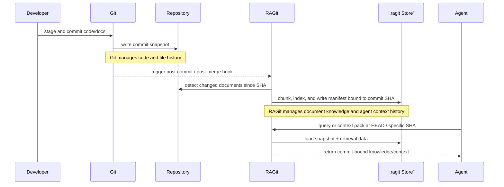

# RAGit

RAGit is a **zvec + git bound RAG CLI** that runs inside your project repository.  
It collects, analyzes, and retrieves documents produced during AI agent workflows, then version-controls snapshots bound to commit SHAs.

## Product Purpose

RAGit is a local-first RAG CLI that turns AI agent project documents and context into commit-bound, reusable knowledge inside the repository.

RAGit is not a giant transcript archive. It is an agent-first collaboration memory system that preserves the smallest reusable state needed to resume work at a given commit: goal, constraints, stable decisions, open loops, and next actions. By separating active working memory from durable searchable memory, it helps the next agent recover momentum without replaying the entire past.

## Runtime Structure

The runtime structure below shows how `ragit` connects the CLI, command layer, core services, git-bound snapshots, and local storage.

```text
                               ┌────────────┐
                               │User / Agent│
                               ├────────────┤
                               └────────────┘
                                      |
                                      |
                                 ┌─────────┐
                                 │ragit CLI│
                                 ├─────────┤
                                 └─────────┘
                                      |
                       ┌────────────────────────────┐
                       │Command Layer               │
                       ├────────────────────────────┤
                       │init                        │
                       │ingest                      │
                       │query                       │
                       │context pack                │
                       │memory                      │
                       │session / artifact / harness│
                       └────────────────────────────┘
                                      |

                            ┌───────────────────┐
                            │Core Services      │
 ┌─────────────────┐        ├───────────────────┤
 │Git commit / HEAD│        │doc authority      │
 ├─────────────────┤        │manifest           │
 │snapshot binding │        │retrieval          │
 └─────────────────┘        │memory             │
           |                │artifacts / harness│
           |                └───────────────────┘
           |
┌────────────────────┐                               ┌─────────────┐
│.ragit control plane│              ┌────────────┐   │Outputs      │
├────────────────────┤  ┌───────┐   │.ragit/store│   ├─────────────┤
│config              │  │docs/**│   ├────────────┤   │query hits   │
│manifest            │  ├───────┤   │documents   │   │context pack │
│memory              │  └───────┘   │chunks      │   │recall packet│
│artifacts           │              └────────────┘   └─────────────┘
└────────────────────┘
```

- `ragit CLI` is the single entrypoint. Every user or agent workflow starts by dispatching a command through the command layer.
- `Git commit / HEAD` binds manifest selection, so retrieval and recall stay reproducible at a specific repository state.
- `.ragit control plane` stores configuration and tracked knowledge state, while `.ragit/store` holds the local vector index for `documents` and `chunks`.
- User-facing outputs are produced from the same runtime core: `query hits`, `context pack`, and `recall packet`.

## Git vs RAGit

Git version-controls source code states. RAGit version-controls AI-working knowledge states bound to the same commit history.


```mermaid
sequenceDiagram
    participant Developer
    participant Git
    participant Repository
    participant RAGit
    participant Store as ".ragit Store"
    participant Agent

    Developer->>Git: stage and commit code/docs
    Git->>Repository: write commit snapshot
    Note over Git,Repository: Git manages code and file history
    Git-->>RAGit: trigger post-commit / post-merge hook
    RAGit->>Repository: detect changed documents since SHA
    RAGit->>Store: chunk, index, and write manifest bound to commit SHA
    Note over RAGit,Store: RAGit manages document knowledge and agent context history
    Agent->>RAGit: query or context pack at HEAD / specific SHA
    RAGit->>Store: load snapshot + retrieval data
    RAGit-->>Agent: return commit-bound knowledge/context
```

- Git answers: "What did the repository look like at this commit?"
- RAGit answers: "What knowledge and context should an agent use at this commit?"
- Together they make code state and AI context state reproducible.

## Core Value

- Preserve project context across AI agent work
- Reproduce knowledge at a specific commit state
- Turn structured docs into agent-ready inputs
- Automate indexing without adding workflow friction

## MVP Document Types (v0.1)

- `Architecture Decision (ADR)`: durable decision record with rationale and consequences
- `Product Requirement (PRD)`: product problem, users, goals, and success criteria
- `Software Requirements (SRS)`: system-level functional and non-functional requirements
- `Implementation Specification (SPEC)`: implementation-level functional requirements and interface contracts
- `Plan`: execution sequencing, milestones, and work breakdown
- `Domain-Driven Design (DDD)`: bounded contexts, aggregates, and domain structure
- `Glossary`: shared vocabulary for stable project terms
- `Phase and Binding Documents (PBD)`: phase and binding topology for understanding implementation structure and coupling

## SAD/HLD/LLD Compatibility Layer

RAGit does not add `SAD`, `HLD`, or `LLD` as new canonical document types.
Instead, it treats them as external architecture views layered on top of the existing document system.

- `SAD`: repository or system-wide architecture explanation, usually read across architecture overviews plus related `ADR` documents
- `HLD`: higher-level module boundaries, data flow, and topology, usually expressed with `SRS`, `DDD`, and `PBD`
- `LLD`: implementation-unit contracts, interfaces, and state details, usually expressed with `SPEC`

When authors want to make that view explicit, they can add an optional frontmatter hint:

```yaml
---
type: spec
architecture_view: lld
---
```

`architecture_view` is advisory only.
RAGit still classifies, validates, ingests, and retrieves documents by canonical `type`.

## Installation

Requirements:

- Node.js `20.19.0` or newer
- pnpm `10.13.1` or newer

For repository-local development:

```bash
pnpm install
pnpm ragit --help
```

Inside this repository checkout, run CLI commands with `pnpm ragit <command>`.

For the published CLI:

```bash
npm install -g ragit
pnpm add -g ragit
bun add -g ragit
npx ragit --help
```

When the package is installed globally, use `ragit <command>`.

`pnpm build` is optional for repository-local usage.
Run it only when you need to generate `dist/` artifacts or verify the packaged CLI entrypoint.

```bash
pnpm build
```

## Documentation (Fumadocs + GitHub Pages)

- Primary URL (English): `https://rhiokim.github.io/ragit/en/`
- Korean URL: `https://rhiokim.github.io/ragit/ko/`
- English is the source of truth, and Korean is provided in the same structure.

Run locally:

```bash
pnpm docs:dev
```

Build static output and preview:

```bash
pnpm docs:check:i18n
pnpm docs:build
pnpm docs:serve
```

Deployment:

- GitHub Actions deploys automatically to `gh-pages` when `main` is pushed.
- For manual redeploy, run `docs-gh-pages` via `workflow_dispatch`.
- In Repository Settings > Pages, set Source to `gh-pages` / root(`/`).

## Package Publishing

- `publish.yml` validates tags against `package.json.version` and publishes only on `vX.Y.Z` tag pushes.
- `workflow_dispatch` runs the same release checks without publishing, so you can rehearse the pipeline before the first release.
- Before enabling automatic publish, configure npm Trusted Publishing for `rhiokim/ragit` and the GitHub Actions workflow.

Release validation flow:

```bash
pnpm release:check
VERSION=$(node -p 'require("./package.json").version')
git tag "v${VERSION}"
git push origin --tags
```

## Core Commands

```bash
pnpm ragit describe query --format json
pnpm ragit init
pnpm ragit init --yes --output json
pnpm ragit init --yes --git-init
pnpm ragit log --max-count 5 --view default --format both
pnpm ragit drift --scope all --view default --format both
pnpm ragit config set retrieval.top_k 8
pnpm ragit hooks install --dry-run --format json
pnpm ragit ingest --all --dry-run --format json
pnpm ragit query "DDD bounded context principles" --view minimal --format both
pnpm ragit context pack "Implementation plan for this sprint" --budget 1200 --view minimal --format both
pnpm ragit memory wrap --input session-wrap.json --dry-run --format json
pnpm ragit memory recall "resume auth flow" --view minimal --format both
pnpm ragit memory promote --input promotion-batch.json --dry-run --format json
pnpm ragit migrate from-json-store --dry-run
pnpm ragit migrate from-sqlitevss --dry-run
pnpm ragit status --format json
pnpm ragit doctor --format json
```

## How Ingest Works

The flow below shows how `ragit ingest` turns repository documents and bound artifacts into a searchable snapshot.

```text
        ┌─┐                                                                                                                                                       
        ║"│                                                                                                                                                       
        └┬┘                                                                                                                                                       
        ┌┼┐                                                                                            ┌─────────┐                                                
         │                        ┌─────┐                 ┌──────┐                     ┌────┐          │Session /│          ┌───────┐                             
        ┌┴┐                       │ragit│                 │run   │                     │Repo│          │Harness  │          │.ragit/│          ┌────────┐         
      User /                      │CLI  │                 │Ingest│                     │docs│          │artifacts│          │store  │          │Manifest│         
      Agent                       └──┬──┘                 └──┬───┘                     └─┬──┘          └────┬────┘          └───┬───┘          └───┬────┘         
        │      ragit ingest ...      │                       │                           │                  │                   │                  │              
        │ ───────────────────────────>                       │                           │                  │                   │                  │              
        │                            │                       │                           │                  │                   │                  │              
        │                            │    parse mode         │                           │                  │                   │                  │              
        │                            │    + source options   │                           │                  │                   │                  │              
        │                            │ ──────────────────────>                           │                  │                   │                  │              
        │                            │                       │                           │                  │                   │                  │              
        │                            │                       │────┐                      │                  │                   │                  │              
        │                            │                       │    │ ensure .ragit        │                  │                   │                  │              
        │                            │                       │<───┘ load config          │                  │                   │                  │              
        │                            │                       │      check HEAD           │                  │                   │                  │              
        │                            │                       │                           │                  │                   │                  │              
        │                            │                       │                           │                  │                   │                  │              
        │                            │                       │     resolve candidates    │                  │                   │                  │              
        │                            │                       │ ──────────────────────────>                  │                   │                  │              
        │                            │                       │                           │                  │                   │                  │              
        │                            │                       │                           │                  │                   │                  │              
        │                            │          ╔═══════╤════╪═══════════════════════════╪════════════╗     │                   │                  │              
        │                            │          ║ LOOP  │  each supported doc            │            ║     │                   │                  │              
        │                            │          ╟───────┘    │                           │            ║     │                   │                  │              
        │                            │          ║            │ hash -> mask -> detect    │            ║     │                   │                  │              
        │                            │          ║            │ validate -> chunk -> embed│            ║     │                   │                  │              
        │                            │          ║            │ ──────────────────────────>            ║     │                   │                  │              
        │                            │          ╚════════════╪═══════════════════════════╪════════════╝     │                   │                  │              
        │                            │                       │                           │                  │                   │                  │              
        │                            │                       │                           │                  │                   │                  │              
        │               ╔══════╤═════╪═══════════════════════╪═══════════════════════════╪══════════════════╪═══════════════════╪══════════════════╪═════════════╗
        │               ║ ALT  │  --dry-run                  │                           │                  │                   │                  │             ║
        │               ╟──────┘     │                       │                           │                  │                   │                  │             ║
        │               ║            │ return planned summary│                           │                  │                   │                  │             ║
        │               ║            │ <─ ─ ─ ─ ─ ─ ─ ─ ─ ─ ─                            │                  │                   │                  │             ║
        │               ╠════════════╪═══════════════════════╪═══════════════════════════╪══════════════════╪═══════════════════╪══════════════════╪═════════════╣
        │               ║ [apply]    │                       │                           │                  │                   │                  │             ║
        │               ║            │                       │           bind pending artifacts             │                   │                  │             ║
        │               ║            │                       │           + build artifact chunks            │                   │                  │             ║
        │               ║            │                       │ ────────────────────────────────────────────>│                   │                  │             ║
        │               ║            │                       │                           │                  │                   │                  │             ║
        │               ║            │                       │                       write docs + chunks    │                   │                  │             ║
        │               ║            │                       │ ────────────────────────────────────────────────────────────────>│                  │             ║
        │               ║            │                       │                           │                  │                   │                  │             ║
        │               ║            │                       │                           │    build + write snapshot            │                  │             ║
        │               ║            │                       │ ────────────────────────────────────────────────────────────────────────────────────>             ║
        │               ║            │                       │                           │                  │                   │                  │             ║
        │               ║            │                       │                        ingest summary        │                   │                  │             ║
        │               ║            │ <─ ─ ─ ─ ─ ─ ─ ─ ─ ─ ─ ─ ─ ─ ─ ─ ─ ─ ─ ─ ─ ─ ─ ─ ─ ─ ─ ─ ─ ─ ─ ─ ─ ─ ─ ─ ─ ─ ─ ─ ─ ─ ─ ─ ─ ─ ─ ─ ─ ─ ─ ─ ─ ─              ║
        │               ╚════════════╪═══════════════════════╪═══════════════════════════╪══════════════════╪═══════════════════╪══════════════════╪═════════════╝
        │                            │                       │                           │                  │                   │                  │              
        │ searchable snapshot summary│                       │                           │                  │                   │                  │              
        │ <─ ─ ─ ─ ─ ─ ─ ─ ─ ─ ─ ─ ─ ─                       │                           │                  │                   │                  │              
        │                            │                       │                           │                  │                   │                  │              
        │                            │                       │                           │                  │                   │                  │              
```

- Candidate resolution changes by mode: explicit `--path`, glob-style `--files`, incremental `--since`, or the default full-snapshot scan.
- `--dry-run` stops before writing `.ragit/store` or a new manifest and only returns the planned ingest summary.
- The apply path is where pending artifact binding, artifact chunk construction, and store/manifest writes actually happen.
- The final searchable truth comes from the manifest snapshot, not from raw files or chunks alone.

## Storage Layout

```text
.ragit/
  config.toml
  guide/guide-index.json
  guide/templates/
  manifest/<commit-sha>.json
  memory/sessions/
  memory/working/
  store/meta.json
  store/documents/
  store/chunks/
  cache/
  hooks/
docs/
  memory/
    decisions/
    glossary/
    plans/
```

- Recommended for Git tracking: `.ragit/config.toml`, `.ragit/manifest/**`, `.ragit/memory/**`, `docs/memory/**`
- Local-only (default `.gitignore`): `.ragit/store/**`, `.ragit/cache/**`

## Memory OS MVP

- `memory wrap`: save a session summary into `.ragit/memory/sessions/` and refresh working state in `.ragit/memory/working/`
- `memory recall`: combine working state and snapshot-scoped retrieval into an agent-ready recall packet
- `memory promote`: crystallize promotion candidates into searchable long-term docs under `docs/memory/**` and ingest them immediately when `HEAD` exists

This split is intentional:

- `.ragit/memory/**` is the tracked control plane for working state and session history
- `docs/memory/**` is the searchable long-term memory corpus that participates in normal ingest/query flows

## Agent CLI Contract

- Prefer `--format json` for machine consumers.
- Use `ragit describe <command> --format json` before integrating a command for the first time.
- Prefer `--view minimal` for `query`, `context pack`, and `memory recall`.
- Prefer `--input <path|->` for structured agent payloads.
- Run mutating commands with `--dry-run` first: `ingest`, `hooks install`, `hooks uninstall`, `memory wrap`, `memory promote`.

## Canonical Agent Skill

- Repository-managed source: [`skills/use-ragit`](./skills/use-ragit)
- Codex install target: `${CODEX_HOME:-$HOME/.codex}/skills/use-ragit` via copy or symlink
- Shared agent-neutral references for Claude and Gemini: [`skills/use-ragit/references/`](./skills/use-ragit/references/)

## Discover-First `init`

`pnpm ragit init` is now a discover-first bootstrap command.
It still prepares `.ragit/**`, `AGENTS.md`, guide assets, and the local zvec store, but it does that only after it inspects the repository and decides what knowledge already exists.

Default flow:

1. Check Git environment (and optionally run `git init`)
2. Scan repository code/docs/build files
3. Select `empty`, `existing`, `docs-heavy`, or `monorepo`
4. Compute documentation coverage, maturity, and knowledge-slot mapping
5. Reuse existing repository docs first and plan missing foundational docs
6. Write stage-1 draft docs plus `.ragit/**`
7. Bootstrap the zvec canonical store
8. Print the final summary and next actions

What `init` prepares:

- Git-aware repository normalization
- Existing-doc discovery and coverage evaluation
- Stage-1 foundational drafts when missing:
  - `RAGIT.md`
  - `docs/workspace-map.md`
  - `docs/ragit/ingestion-policy.md`
  - `docs/known-gaps.md`
  - `docs/adr/README.md`
- `.ragit/config.toml`, `.ragit/guide/templates/*`, and `.ragit/guide/guide-index.json`
- Empty zvec collections under `.ragit/store/`
- Next-action guidance for `hooks install` and `ingest`

What `init` does not prepare:

- No searchable corpus, chunk records, or manifests
- No zvec document/chunk upsert
- No query-ready knowledge state during `init`

In other words, `init` makes the repository **diagnosed**, **foundation-ready**, and **zvec-store-ready**, not **search-ready**.
`storage.backend = "zvec"` still means the canonical backend, and searchable knowledge still begins only after `pnpm ragit ingest ...` runs.

Supported options:

```bash
pnpm ragit init --mode auto --strategy balanced --merge-existing
pnpm ragit init --yes              # non-interactive with defaults
pnpm ragit init --non-interactive  # alias of --yes
pnpm ragit init --git-init         # allow git init in non-interactive mode
pnpm ragit init --dry-run --output json
pnpm ragit init --output json      # JSON summary output
```

- `--cwd` may point to the repository root or any nested path inside the worktree; `init` normalizes to the Git root before writing `.ragit` or `AGENTS.md`.
- `--mode` overrides repository-mode detection.
- `--strategy` controls how aggressively stage-1 draft docs are generated.
- `--dry-run` computes the full analysis report without writing files or bootstrapping storage.
- zvec bootstrap currently supports `darwin/arm64`, `linux/arm64`, and `linux/x64`.

Recommended flow after `init`:

```bash
pnpm ragit migrate from-json-store   # only if summary says migrationRequired=true
pnpm ragit hooks install
pnpm ragit ingest --all
```

## Hook Strategy

- `post-commit`: automatically indexes changes from `HEAD~1..HEAD`
- `post-merge`: automatically indexes changes from `${ORIG_HEAD:-HEAD~1}..HEAD`
- Failures are warning-only and do not block commit/merge flows.

## Retrieval Strategy

- 1st pass: zvec vector search scoped to the snapshot manifest
- 2nd pass: keyword score
- Final score: `alpha * vector + (1-alpha) * keyword` (default `alpha=0.7`)

## Security Defaults

- Secret masking is enabled by default during ingestion (`security.secret_masking=true`)
- OpenAI/GitHub/AWS keys and `api_key/token/secret` patterns are masked.

## License

RAGit is licensed under Apache-2.0.
The root [LICENSE](./LICENSE) file is the single source of truth for license terms across this repository.

## Test

```bash
pnpm test
```
