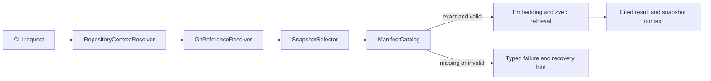

# Snapshot Selection Integrity Design

## Summary

RAGit must return knowledge from the requested Git state and no other state. If it cannot prove that an exact, valid snapshot exists for the requested commit, it must return a structured failure or an explicitly degraded result instead of silently selecting another manifest.

This document defines the first workstream in the `Trustworthy Retrieval Core` program. It covers repository-context normalization, Git reference resolution, exact manifest selection, safe incremental-ingest bases, dirty-document admission, structured failures, compatibility, and the verification and rollout gates for those behaviors.

## Program Boundary

The practical-readiness program is split into four independently designed workstreams:

1. **Snapshot Selection Integrity**
   - Select only the manifest that belongs to the requested commit.
   - Make branch, worktree, dirty-state, and missing-snapshot behavior explicit.
   - This document defines this workstream.
2. **Retrieval Quality and Evaluation**
   - Replace or clearly label placeholder embedding behavior.
   - Establish retrieval benchmarks, ranking quality, citations, and explanation.
3. **Atomic Ingest and Recovery**
   - Add exclusive ingest coordination, transactional store/manifest generation handling, deterministic rebuild, and orphan cleanup.
4. **Distribution and Packaged E2E**
   - Prove installation, upgrade, native dependency, and packaged CLI behavior across the supported platform matrix.

The full program, not this workstream alone, is the release gate for claiming practical readiness.

## Product Contract

> RAGit returns knowledge only from the requested Git state. If it cannot prove that an exact snapshot exists for that state, it does not silently use another snapshot.

The primary user is an individual developer or small development team using AI coding agents inside a Git repository. The primary job is to recover or assemble project context for a known repository state without receiving knowledge from an unrelated branch or commit.

## Goals

- Normalize any command working directory to the active Git worktree root.
- Resolve `HEAD`, a full commit SHA, or a unique commit SHA prefix to a concrete commit.
- Require an exact manifest for read-side retrieval.
- Remove lexicographical latest-manifest fallback from retrieval and incremental-ingest base selection.
- Make dirty worktree state visible without treating uncommitted files as commit-bound knowledge.
- Prevent incremental ingest from inheriting an unrelated or incomplete base snapshot.
- Publish individual manifest files atomically.
- Return stable machine-readable failures and exit codes.
- Preserve existing manifest files and the legacy `snapshotSha` output field.

## Non-goals

- Indexing uncommitted working-tree content as an ephemeral overlay.
- Accepting branch names, tags, or arbitrary revision expressions through `--at`.
- Adding code indexing or new document types.
- Adding a new storage backend.
- Adding remote synchronization, team permissions, MCP integration, or UI work.
- Solving exclusive ingest locking, full store transactions, or orphan garbage collection; those belong to Atomic Ingest and Recovery.
- Rewriting existing manifest files during reads.

## Key Decisions

### Exact selection is mandatory

Default retrieval selects the exact manifest for the current `HEAD`. Explicit retrieval selects the exact manifest for the normalized SHA supplied through `--at`. A nearest indexed ancestor may be reported as a recovery hint, but it is never used automatically.

### Commit-bound ingest requires committed documents

Ingest currently reads working-tree files and binds their content to `HEAD`. That is not reproducible when an ingest candidate differs from the committed file. Apply-mode ingest therefore rejects dirty or untracked ingest candidates. Code-only worktree changes do not block ingest when no ingest candidate is dirty.

Dry-run does not mutate and does not terminate early. It reports `wouldFail=true` and the candidate paths that would prevent apply.

### Compatibility is additive

Existing `snapshotSha` fields and string `warnings` remain available. A structured `snapshot` block and structured `error` block are additive. Existing manifest files are normalized in memory and never rewritten merely because they were read.

### No transitional unsafe fallback

The implementation does not add a compatibility flag that preserves silent fallback. Because strict failure replaces some formerly successful behavior, the public release is part of the next major release after all four practical-readiness workstreams pass their gates.

## Architecture

### RepositoryContextResolver

`RepositoryContextResolver` normalizes a requested directory to the active Git worktree root and returns:

- `gitRoot`
- `headSha`
- `branch`
- `detached`
- `worktreeDirty`
- `dirtyPathCount`

Every affected command must use the resolved worktree root for configuration, manifests, store paths, memory paths, and status output. Linked worktrees use the `.ragit` state visible within their own worktree; this workstream does not introduce implicit cross-worktree runtime-state sharing.

### GitReferenceResolver

`GitReferenceResolver` provides Git facts without making snapshot policy decisions. It supports:

- resolving `HEAD`
- verifying a full commit SHA
- resolving a unique commit SHA prefix
- rejecting an ambiguous or nonexistent prefix
- checking whether one commit is an ancestor of another
- listing commits from a target toward its ancestors for diagnostic nearest-snapshot discovery
- reporting dirty candidate paths relative to `HEAD`

### ManifestCatalog

`ManifestCatalog` owns manifest storage facts only:

- list manifest SHAs
- test exact existence
- load and normalize a manifest
- validate that the manifest filename SHA equals `manifest.commitSha`
- reject malformed JSON
- reject unsupported future schema versions

It does not choose a fallback snapshot.

### SnapshotSelector

`SnapshotSelector` is the shared read-side policy. It accepts repository context and an optional `--at` value and returns `SnapshotSelection` or a typed failure.

Default selection:

1. Capture the current `HEAD`.
2. Require an exact manifest for that SHA.
3. Load and validate the manifest.
4. Capture `HEAD` again.
5. If `HEAD` changed, retry the full selection once.
6. If `HEAD` changes again, return `REPOSITORY_STATE_CHANGED`.

Explicit selection:

1. Normalize the supplied full SHA or unique prefix to a commit SHA.
2. Require the exact manifest for the normalized SHA.
3. Load and validate the manifest.
4. Ignore unrelated subsequent `HEAD` movement because the requested commit is fixed.

### IngestBaseSelector

`IngestBaseSelector` shares Git and manifest primitives with `SnapshotSelector` but exposes ingest-specific rules rather than a configurable general-purpose mode.

- `ingest --all`
  - Uses no base manifest.
  - Builds a full snapshot from committed, clean ingest candidates.
- `ingest --since S`
  - Resolves `S` to a commit.
  - Requires `S` to be an ancestor of `HEAD`.
  - Requires the exact manifest for `S`.
  - Uses that manifest as the incremental base.
- Hook-driven post-commit ingest
  - Uses the exact parent commit as `S`.
  - Fails safely and recommends `ingest --all` when the parent has no manifest.
- `ingest --files` and `ingest --path`
  - Uses an existing exact `HEAD` manifest when available.
  - Otherwise uses the exact parent manifest.
  - Fails when neither exists because a partial selection cannot produce a complete snapshot without a trusted base.

### RetrievalContext

`RetrievalContext` carries the validated selection into `query`, `context pack`, `memory recall`, and `status`. Snapshot selection and validation occur before query embedding or store access, so an unavailable snapshot cannot cause remote embedding traffic or provider cost.

For strict retrieval, the runtime validates the selected manifest, opens and validates the store contract, and only then computes the query embedding. Artifact-only degraded recall does not enter this path.



## Read-side Output Contract

The existing `snapshotSha` field remains. A new additive `snapshot` block exposes selection context:

```json
{
  "snapshotSha": "abc123...",
  "snapshot": {
    "requestedRef": "HEAD",
    "resolvedSha": "abc123...",
    "selection": "head-exact",
    "status": "indexed",
    "branch": "main",
    "detached": false,
    "worktreeDirty": true
  }
}
```

Allowed `selection` values in this workstream are `head-exact` and `explicit-exact`.

Allowed `status` values are:

- `indexed`
- `missing`
- `invalid`
- `store-unavailable`
- `unavailable`, used only for explicitly degraded recall output

## Command Behavior

### query

- Requires an exact, valid snapshot and usable store.
- Returns no hits when selection fails.
- Reports the resolved SHA and dirty-state metadata on success.

### context pack

- Uses the same strict selection contract as `query`.
- Does not produce a context packet without an exact snapshot.

### memory recall

- Attempts exact snapshot retrieval through the shared selector.
- May return working memory and artifact-derived content when snapshot retrieval is unavailable.
- Uses keyword-only artifact selection in this degraded path and does not call an embedding provider.
- Marks the result with `snapshot.status=unavailable`, `snapshotSha=null`, and an explicit warning.
- Never represents artifact-only output as snapshot-backed knowledge.

### status

- Remains a diagnostic command rather than failing merely because a snapshot is absent.
- Reports `indexed`, `missing`, `invalid`, or `store-unavailable` for the current HEAD.

### ingest

- Uses `IngestBaseSelector` for all non-full ingest modes.
- Refuses to bind dirty or untracked ingest candidates to `HEAD` in apply mode.
- Reports dirty candidate failures in dry-run without writing.

## Error Contract

Snapshot-selection failures use a typed error that can be projected into the CLI envelope:

```json
{
  "command": "query",
  "ok": false,
  "version": "1.1.1",
  "cwd": "/repo",
  "data": null,
  "warnings": [],
  "error": {
    "code": "SNAPSHOT_NOT_INDEXED",
    "category": "not_ready",
    "message": "The current HEAD has no indexed snapshot.",
    "retryable": false,
    "details": {
      "resolvedSha": "abc123...",
      "nearestIndexedAncestor": "def456..."
    },
    "recovery": {
      "command": "ragit ingest --since def456..."
    }
  }
}
```

The text format prints the same code, message, and recovery command without JSON.

### Stable error codes

- `SNAPSHOT_REF_INVALID`
- `SNAPSHOT_REF_AMBIGUOUS`
- `SNAPSHOT_NOT_INDEXED`
- `SNAPSHOT_MANIFEST_INVALID`
- `SNAPSHOT_SCHEMA_UNSUPPORTED`
- `SNAPSHOT_STORE_UNAVAILABLE`
- `INGEST_BASE_NOT_INDEXED`
- `INGEST_BASE_NOT_ANCESTOR`
- `INGEST_CANDIDATES_DIRTY`
- `REPOSITORY_STATE_CHANGED`

### Stable exit-code classes

- `1`: unexpected internal error
- `2`: invalid or ambiguous user input
- `3`: state is not ready and requires initialization, ingest, or retry
- `4`: local manifest or store state is corrupt or incompatible

`REPOSITORY_STATE_CHANGED` is retryable and exits with `3`. Dirty query state is a warning, not an error. `INGEST_CANDIDATES_DIRTY` exits with `3` in apply mode.

| Error code | Exit code |
| --- | ---: |
| `SNAPSHOT_REF_INVALID` | `2` |
| `SNAPSHOT_REF_AMBIGUOUS` | `2` |
| `SNAPSHOT_NOT_INDEXED` | `3` |
| `SNAPSHOT_MANIFEST_INVALID` | `4` |
| `SNAPSHOT_SCHEMA_UNSUPPORTED` | `4` |
| `SNAPSHOT_STORE_UNAVAILABLE` | `3` |
| `INGEST_BASE_NOT_INDEXED` | `3` |
| `INGEST_BASE_NOT_ANCESTOR` | `2` |
| `INGEST_CANDIDATES_DIRTY` | `3` |
| `REPOSITORY_STATE_CHANGED` | `3` |

## Dirty Worktree Policy

Read commands are allowed in a dirty worktree because they read an already committed snapshot. They must expose `worktreeDirty=true` and state that uncommitted changes are not included.

Apply-mode ingest checks only the ingest candidates relevant to that operation:

- A tracked candidate whose worktree content differs from `HEAD` blocks ingest.
- An untracked candidate blocks ingest because it cannot belong to `HEAD`.
- A worktree deletion of a file that exists at `HEAD` blocks ingest until committed.
- Dirty source-code files do not block a document-only ingest when none of those files are candidates.

The onboarding contract therefore becomes:

1. initialize the repository
2. create or update foundational documents
3. commit those documents
4. run ingest
5. verify status and query

Ephemeral working-tree retrieval is deferred to a separate design.

## Concurrency and Publication

### HEAD movement

Default selection captures `HEAD` before and after manifest loading. It retries once when the SHA changes and returns `REPOSITORY_STATE_CHANGED` after a second movement. Explicit SHA selection is independent of later `HEAD` changes.

### Atomic manifest publication

Manifest writes use a uniquely named temporary file in the manifest directory followed by rename to the final SHA path. Readers do not lock and only observe the previous complete manifest or the new complete manifest.

The ingest ordering remains:

1. write append-only document and chunk records
2. construct the complete manifest
3. atomically publish the manifest

Failure before step 3 may leave unreachable store records, but no selector can observe them through a manifest. Their cleanup belongs to Atomic Ingest and Recovery.

### Deferred concurrency work

This workstream does not claim to solve two concurrent ingests that target the same SHA. Exclusive ingest locking, stale-lock recovery, full store/manifest transaction boundaries, and orphan garbage collection are explicit dependencies of the later Atomic Ingest and Recovery workstream. The full P0 program cannot ship as practically ready before that dependency is complete.

## Manifest Compatibility

- `indexVersion < 3`: normalize to the current in-memory shape.
- `indexVersion === 3`: accept and validate.
- `indexVersion > 3`: return `SNAPSHOT_SCHEMA_UNSUPPORTED` rather than guessing how to read a future schema.
- A manifest whose filename SHA differs from `manifest.commitSha`: return `SNAPSHOT_MANIFEST_INVALID`.
- Reading an older manifest never rewrites it.
- No data migration is introduced by this workstream.

## Verification Strategy

Verification uses four layers:

1. pure policy tests with fake Git and manifest adapters
2. integration tests with temporary real Git repositories
3. spawned CLI contract tests for text, JSON, stderr, and exit codes
4. installed-package E2E using the produced tarball

### Required test matrix

| Area | Scenarios |
| --- | --- |
| Repository context | root and nested cwd, linked worktree, detached HEAD, repository without a commit |
| Reference resolution | HEAD, full SHA, unique prefix, ambiguous prefix, nonexistent SHA |
| Branch isolation | divergent branches, current branch missing a manifest, another branch containing a manifest |
| Dirty state | modified document, untracked document, deleted document, code-only modification |
| Ingest base | full ingest, indexed ancestor, non-ancestor, partial ingest with HEAD base, partial ingest with parent base, missing base |
| Manifest compatibility | older manifest, v3 manifest, future version, SHA mismatch, truncated JSON |
| Command contract | query, context pack, memory recall, and status in text and JSON formats |
| Race behavior | one HEAD change, repeated HEAD changes, query during atomic manifest publication |
| Side effects | no embedding or store call after selection failure |
| Package E2E | init, commit, ingest, query, branch switch, and strict missing-snapshot failure |

## Acceptance Metrics

- Wrong-branch or wrong-SHA snapshot returns: `0`
- Time-travel selection accuracy across the test matrix: `100%`
- Embedding calls after snapshot-selection failure: `0`
- Dirty or untracked documents persisted as commit-bound snapshot content: `0`
- Supported legacy-manifest read success: `100%`
- Future or corrupt manifest explicit-failure rate: `100%`
- Text and JSON exit-code agreement for the same failure: `100%`
- Snapshot-policy selection p95 with 1,000 manifests on the reference local environment: at most `100 ms`
- Contract regressions for existing `snapshotSha` consumers: `0`

## Rollout

1. Capture existing behavior with regression tests before changing selection.
2. Add the shared selector and move `query`, `context pack`, `memory recall`, and `status` onto it one at a time.
3. Add strict incremental-ingest base selection and dirty-candidate admission.
4. Dogfood divergent-branch, detached-HEAD, nested-cwd, and linked-worktree scenarios in the RAGit repository.
5. Update command contracts and onboarding to require commit before ingest.
6. Pass unit, integration, documentation, packaging, and installed-CLI verification.
7. Complete the remaining three practical-readiness workstreams.
8. Publish the combined behavior as the next major release.

This workstream may merge before the other three workstreams, but it must not independently trigger a practical-readiness claim or public major release.

## Rollback

Public rollout stops if any of the following occurs:

- a valid current-HEAD manifest is no longer selected
- a linked worktree resolves the wrong `.ragit` root
- a supported legacy manifest can no longer be read
- packaged query behavior regresses
- selection overhead exceeds the accepted limit without a justified replacement metric

Because this workstream does not migrate or rewrite manifest data, rollback consists of reverting to the previous binary. No reverse data migration is required.

## Likely Implementation Surface

The implementation plan should confirm exact file placement, but the expected surgical surface is:

- `src/core/git.ts`: Git context, SHA normalization, ancestry, and dirty-candidate primitives
- a new focused snapshot-selection module under `src/core/`
- `src/core/manifest.ts`: catalog operations, version validation, and atomic file publication
- `src/core/retrieval.ts`: consume strict selection before embedding
- `src/core/context.ts`: project the shared snapshot context
- `src/core/memory.ts`: explicit artifact-only degraded recall
- `src/core/ingest.ts`: strict base selection and dirty-candidate admission
- `src/commands/bootstrap.ts`: status diagnostics and repository-root normalization
- `src/core/cliContract.ts` and `src/cli.ts`: structured failures and exit-code projection
- focused unit, integration, CLI contract, and package smoke tests
- English and Korean onboarding and affected command documentation

No adjacent refactor is part of this workstream unless a changed line is required to establish the approved contract.

## Deferred Follow-up

The next independently designed workstream is Retrieval Quality and Evaluation. It must not begin implementation until this design has been converted into an implementation plan and Snapshot Selection Integrity has either completed or exposed a concrete dependency that must be resolved first.
